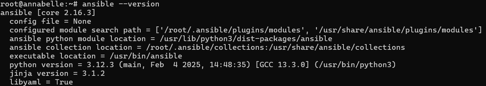
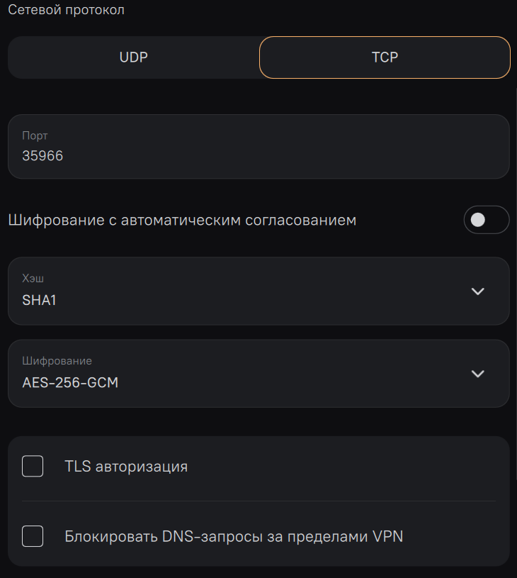
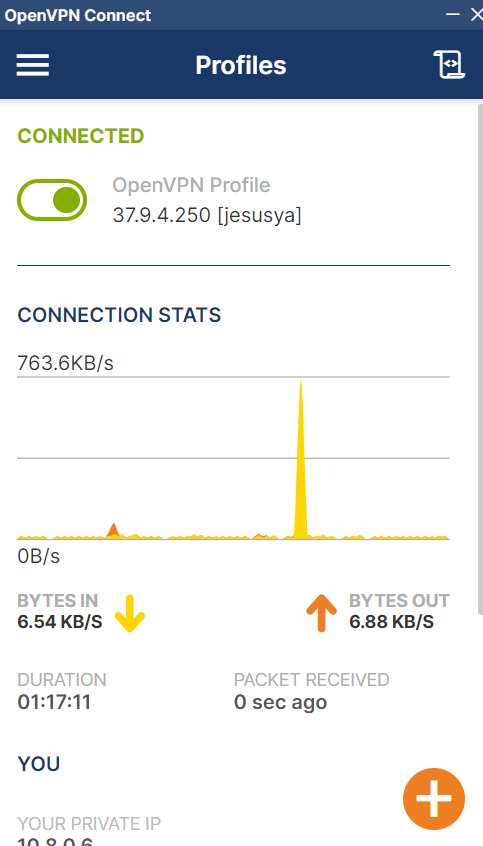
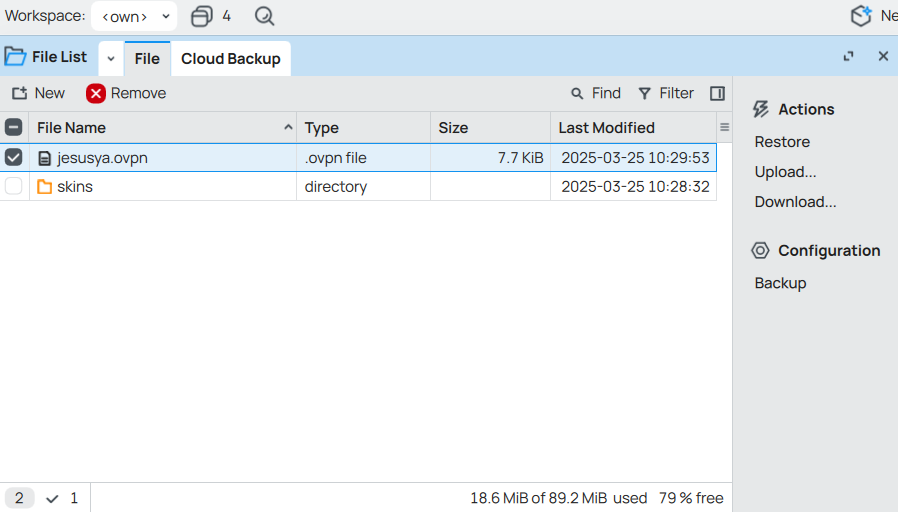
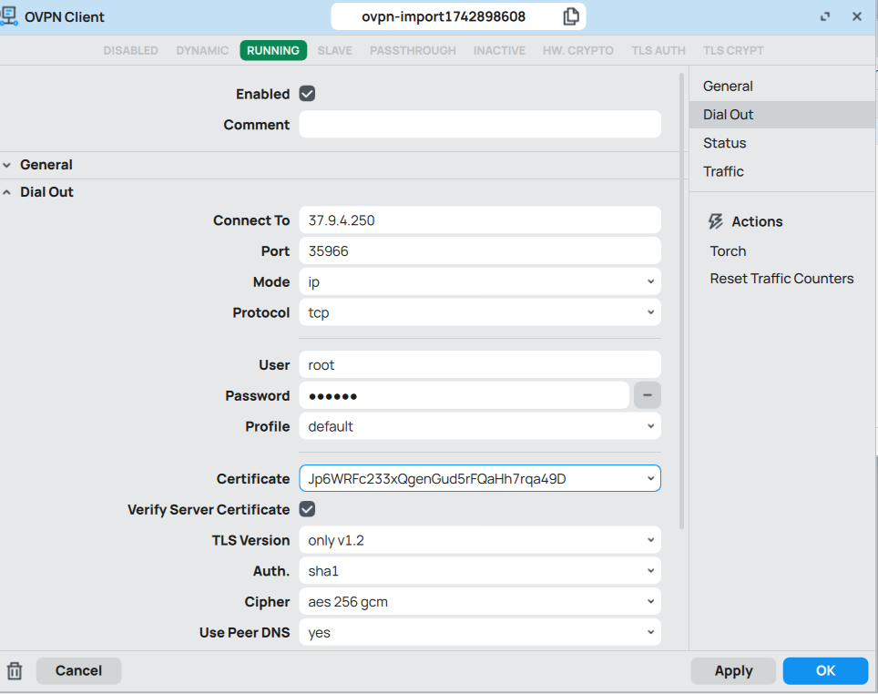
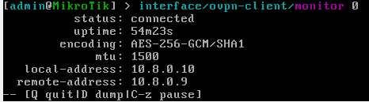
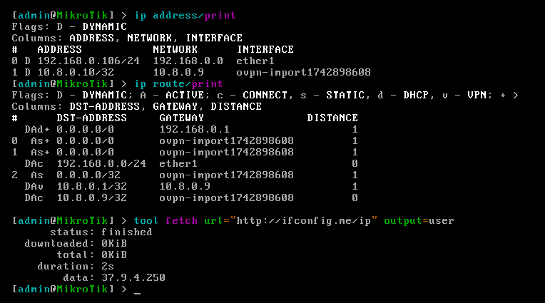

# Отчет по лабораторной работе №1

## Университет
* **University:** [ITMO University](https://itmo.ru/ru/)
* **Faculty:** [FICT](https://fict.itmo.ru)
* **Course:** [Network Programming](https://github.com/itmo-ict-faculty/network-programming)
* **Year:** 2024/2025
* **Group:** K3321
* **Author:** Babayev Ruslan Sagibovich
* **Lab:** Lab1
* **Date of create:** 25.03.2025
* **Date of finished:** 26.03.2025

## Задание

Данная работа предусматривает обучение развертыванию виртуальных машин (VM) и системы контроля конфигураций Ansible а также организации собственных VPN серверов.

Целью данной работы является развертывание виртуальной машины с установленной системой контроля конфигураций Ansible и установка CHR в VirtualBox.

## Описание работы

_Для выполнения работы была арендована виртуальная машина в Selectel._ 

### Конфигурация сервера

Для установки Ansible потребовалась предварительная настройка Python3. С помощью пакетного менеджера `apt` был установлен `python3-pip`, проверена версия Python (3.12), после чего через pip3 выполнена установка Ansible. Корректность установки подтверждена командой ansible --version.
```
sudo apt install python3-pip
ls -la /usr/bin/python3.12
sudo pip3 install ansible
ansible --version
```



Для организации VPN-туннеля между сервером автоматизации и локальным компьютером был развернут OpenVPN-сервер через AmneziaVPN. В настройках отключены TLS-авторизация и блокировка DNS-запросов вне VPN, а также выбраны алгоритмы шифрования SHA1 (для аутентификации) и AES-256-GCM (для передачи данных). Это обеспечило баланс между безопасностью и производительностью.



После импорта сгенерированного `.ovpn`-файла на локальный компьютер VPN-туннель был успешно установлен. Внешний IP-адрес сервера — `37.9.4.250`, что подтверждает корректность маршрутизации трафика через VPN.



### Конфигурация Mikrotik RouterOS

С помощью Oracle VirtualBox был развернут CHR Mikrotik RouterOS. Для настройки OVPN-клиента использовался WinBox:

1. На роутер загружен `.ovpn`-файл, полученный с сервера.
2. Конфигурация импортирована в раздел OVPN Client, где указаны адрес сервера (`37.9.4.250`), порт, протокол (TCP), сертификаты и прочие учетные данные.





Проверка работоспособности:

1. Команда `interface ovpn-client monitor 0` показала статус подключения connected.
2. Добавлен VPN-шлюз, а запрос через `fetch http://ifconfig.me/ip` вернул IP-адрес сервера (`37.9.4.250`), что подтвердило корректную маршрутизацию всего трафика через VPN-туннель.





## Вывод

В ходе работы были выполнены следующие задачи:

1. Развернута виртуальная машина с установкой Ansible для управления конфигурациями.

2. Настроен OpenVPN-сервер с использованием AmneziaVPN, обеспечено безопасное подключение локального компьютера через VPN-туннель.

3. В среде VirtualBox успешно запущен CHR Mikrotik RouterOS, настроен OVPN-клиент с проверкой работоспособности подключения.

Результаты подтвердили возможность создания инфраструктуры для автоматизации развертывания и безопасного управления сетевыми ресурсами через VPN. Основная цель работы достигнута.