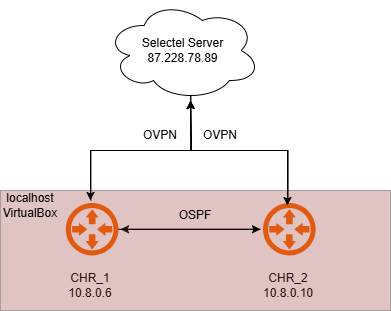
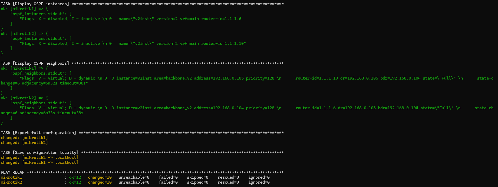
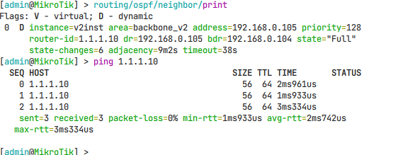
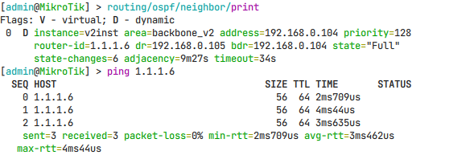

# Отчет по лабораторной работе №2

## Университет
* **University:** [ITMO University](https://itmo.ru/ru/)
* **Faculty:** [FICT](https://fict.itmo.ru)
* **Course:** [Network Programming](https://github.com/itmo-ict-faculty/network-programming)
* **Year:** 2024/2025
* **Group:** K3321
* **Author:** Babayev Ruslan Sagibovich
* **Lab:** Lab2
* **Date of create:** 12.04.2025
* **Date of finished:** 13.04.2025

## Задание

В данной лабораторной работе вы на практике ознакомитесь с системой управления конфигурацией Ansible, использующаяся для автоматизации настройки и развертывания программного обеспечения.

Целью данной работы является настройка нескольких сетевых устройств и сбор информации о них с помощью Ansible. Правильно собрать файл Inventory.

## Ход работы

На втором CHR Mikrotik роутере был подключен OVPN-клиент по аналогии с [первой лабораторной работой](https://github.com/Jesusya-26/2024_2025-network_programming-k3321-babayev_r_s/tree/main/lab_1). В результате, вместе с сервером с уже установленным Ansible, была сформирована сеть с подсетью 10.8.0.0 через VPN. Это позволило объединить устройства в единую логическую инфраструктуру для дальнейшей автоматизации.



Инвентарный файл `hosts.ini` содержит две группы параметров:
- Секция `[routers]` определяет два роутера MikroTik:
  - `mikrotik1` с IP 10.8.0.6, учетными данными и Router ID 1.1.1.6;
  - `mikrotik2` с IP 10.8.0.10, теми же учетными данными и Router ID 1.1.1.10.
- Переменные группы `[routers:vars]` задают подключение через `network_cli` и тип ОС — RouterOS. Это позволяет Ansible корректно взаимодействовать с устройствами.

```
[routers]
mikrotik1 ansible_host=10.8.0.6 ansible_user=admin ansible_ssh_pass=1111 router_id=1.1.1.6
mikrotik2 ansible_host=10.8.0.10 ansible_user=admin ansible_ssh_pass=1111 router_id=1.1.1.10

[routers:vars]
ansible_connection=ansible.netcommon.network_cli
ansible_network_os=community.routeros.routeros
```

Playbook решает следующие задачи:
1. **Настройка NTP Client** — активация синхронизации времени через серверы `pool.ntp.org`.
2. **Создание loopback-интерфейса** с уникальным IP на основе `router_id`.
3. **Конфигурация OSPF**:
   - Создание экземпляра OSPFv2 с указанием Router ID;
   - Добавление области `backbone_v2` (Area ID 0.0.0.0);
   - Настройка шаблона интерфейсов для распространения OSPF на все сети.
4. **Сбор данных** о состоянии OSPF (экземпляры, соседи) и экспорт полной конфигурации устройств в локальные файлы.

```yaml
---
- name: NTP and OSPF configuration on MikroTik CHR
  hosts: routers
  gather_facts: false
  vars:
    ntp_servers: "pool.ntp.org"
    ospf_instance_name: "v2inst"
    ospf_area_name: "backbone_v2"
    ospf_area_id: "0.0.0.0"

  tasks:
    # Настройка NTP Client
    - name: Configure NTP client
      community.routeros.api_find_and_modify:
        hostname: "{{ ansible_host }}"
        username: "{{ ansible_user }}"
        password: "{{ ansible_password }}"
        path: system/ntp/client
        find: {}
        values:
          enabled: "yes"
          servers: "{{ ntp_servers }}"

    # Создание loopback интерфейса
    - name: Create loopback interface if not exists
      community.routeros.command:
        commands:
          - ":if ([/interface bridge find name=loopback0] = \"\") do={ /interface bridge add name=loopback0 }"

    # Добавление IP на loopback
    - name: Assign IP address to loopback
      community.routeros.command:
        commands:
          - ":if ([/ip address find interface=loopback0 address={{ router_id }}/32] = \"\") do={ /ip address add address={{ router_id }}/32 interface=loopback0 }"

    # Настройка OSPF Router ID
    - name: Ensure OSPF instance exists
      community.routeros.command:
        commands:
          - ":if ([/routing ospf instance find name={{ ospf_instance_name }}] = \"\") do={ /routing ospf instance add name={{ ospf_instance_name }} version=2 router-id={{ router_id }} }"

    # Добавление OSPF области
    - name: Configure OSPF backbone area
      community.routeros.command:
        commands:
          - ":if ([/routing ospf area find name={{ ospf_area_name }}] = \"\") do={ /routing ospf area add name={{ ospf_area_name }} area-id={{ ospf_area_id }} instance={{ ospf_instance_name }} }"

    # Добавление OSPF интерфейс-шаблона
    - name: Configure OSPF interface template
      community.routeros.command:
        commands:
          - ":if ([/routing ospf interface-template find networks=0.0.0.0/0] = \"\") do={ /routing ospf interface-template add networks=0.0.0.0/0 area={{ ospf_area_name }} }"

    # Сбор OSPF данных
    - name: Collect OSPF instances info
      community.routeros.command:
        commands:
          - /routing ospf instance print
      register: ospf_instances

    - name: Collect OSPF neighbors info
      community.routeros.command:
        commands:
          - /routing ospf neighbor print
      register: ospf_neighbors

    # Вывод OSPF информации
    - name: Display OSPF instances
      debug:
        var: ospf_instances.stdout

    - name: Display OSPF neighbors
      debug:
        var: ospf_neighbors.stdout

    # Сбор полного конфига устройства
    - name: Export full configuration
      community.routeros.command:
        commands:
          - /export
      register: router_config

    - name: Save configuration locally
      copy:
        content: "{{ router_config.stdout | join('\n') }}"
        dest: "./config_backups/{{ inventory_hostname }}.cfg"
      delegate_to: localhost
```

После выполнения команды `ansible-playbook -i hosts.ini playbook.yaml` все задачи были успешно выполнены (рис. 1). Для проверки:
- На устройствах запущены команды `routing ospf neighbor print`, подтвердившие установление OSPF-соседства;
- Успешный пинг между loopback-адресами роутеров (1.1.1.6 и 1.1.1.10) доказал корректность маршрутизации.







## Вывод

Лабораторная работа позволила освоить базовые принципы автоматизации сетевых устройств через Ansible. Были достигнуты следующие результаты:
1. Создан структурированный Inventory-файл, обеспечивающий централизованное управление параметрами устройств.
2. Реализована автоматическая настройка NTP и OSPF на двух роутерах одновременно, что сократило время ручной конфигурации.
3. Убедились в корректности работы OSPF: соседство установлено, маршруты доступны.
4. Настроен сбор конфигураций устройств для последующего аудита.

Использование Ansible продемонстрировало эффективность инструментов IaC (Infrastructure as Code) для масштабируемого управления сетевой инфраструктурой.
