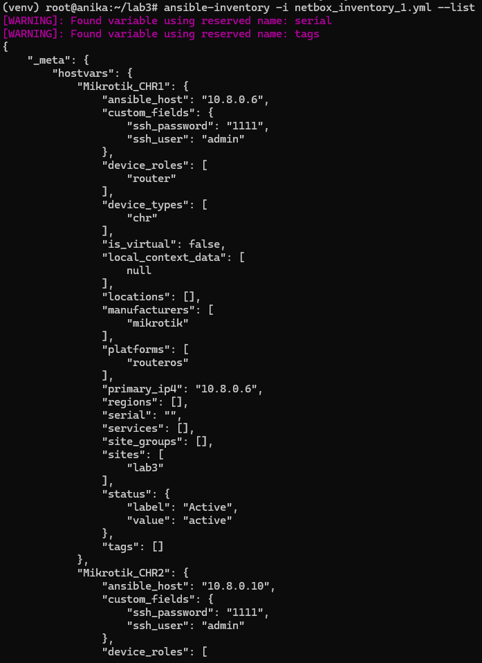
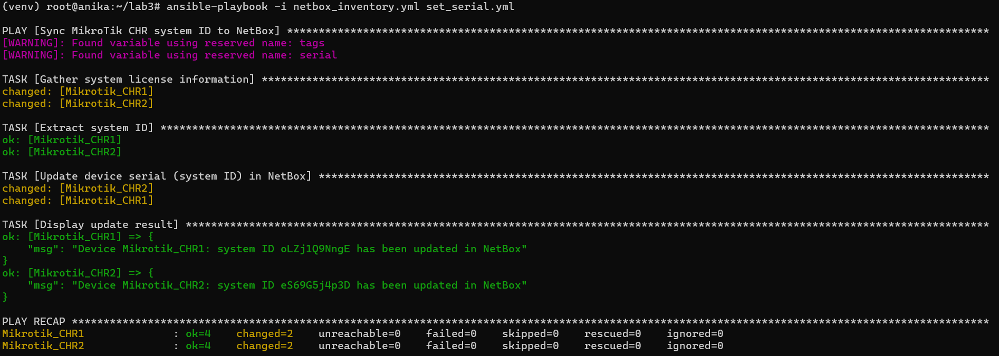

# Отчет по лабораторной работе №3

## Университет
* **University:** [ITMO University](https://itmo.ru/ru/)  
* **Faculty:** [FICT](https://fict.itmo.ru)  
* **Course:** [Network Programming](https://github.com/itmo-ict-faculty/network-programming)  
* **Year:** 2024/2025  
* **Group:** K3321  
* **Author:** Babayev Ruslan Sagibovich  
* **Lab:** Lab3  
* **Date of create:** 27.04.2025  
* **Date of finished:** 28.04.2025  

## Задание

С помощью Ansible и Netbox собрать всю возможную информацию об устройствах и сохранить их в отдельном файле.

1. Поднять Netbox на дополнительной VM.  
2. Заполнить всю возможную информацию о ваших CHR в Netbox.  
3. Используя Ansible и роли для Netbox в тестовом режиме сохранить все данные из Netbox в отдельный файл, результат приложить в отчёт.  
4. Написать сценарий, при котором на основе данных из Netbox можно настроить 2 CHR, изменить имя устройства, добавить IP адрес на устройство.  
5. Написать сценарий, позволяющий собрать серийный номер устройства и вносящий серийный номер в Netbox.  

## Ход работы

С помощью VirtualBox была развернута виртуальная машина под управлением Ubuntu 24.04. На ней установлены все зависимости для Netbox: Docker, Docker Compose, Python-пакеты. После клонирования официального репозитория Netbox и выполнения `docker-compose up -d` был запущен стек Netbox (PostgreSQL, Redis, Netbox API и UI). В веб-интерфейсе (http://10.8.0.14:8000) выполнен вход под администратором, после чего в разделе **Devices** созданы два устройства типа **MikroTik CHR**. Для каждого устройства заполнены следующие поля:
- **Site** и **Device Role**  
- **Device Type** (Vendor: MikroTik, Model: CHR)  
- **Interfaces** (ovpn)  
- **IP Addresses**  
- **Custom Fields** (ssh_user, ssh_password, ip_address, interface)


Далее был подготовлен инвентори-плагин для Ansible, который считывает все устройства из Netbox и формирует статический JSON-файл. Плагин настроен на подключение к API Netbox по адресу `http://10.8.0.14:8000` с использованием токена из переменной окружения `NETBOX_TOKEN`. Валидация сертификата отключена для упрощения проверки.

```yaml
plugin: netbox.netbox.nb_inventory
api_endpoint: http://10.8.0.14:8000
token: "{{ lookup('env', 'NETBOX_TOKEN') }}"
validate_certs: false
```

На выходе работы инвентори-плагина был получен файл `inventory.json`, содержащий детальное описание всех устройств, интерфейсов, адресов и кастомных полей, доступных в Netbox.



Затем был написан плейбук `configure_chr.yml`, который на основании данных из `inventory.json` устанавливает на каждом CHR новое системное имя и добавляет IP-адрес на указанный интерфейс. Плейбук не собирает факты, подключается по `network_cli` к RouterOS и использует модуль `community.routeros.command`. Переменные `ansible_user`, `ansible_password`, `ansible_host` и параметры интерфейса берутся из полей `custom_fields` каждого хоста.

```yaml
- name: Configure Mikrotik CHR devices
  hosts: all
  gather_facts: no

  vars:
    ansible_connection: ansible.netcommon.network_cli
    ansible_network_os: community.routeros.routeros

    ansible_host: "{{ hostvars[inventory_hostname].ansible_host }}"
    ansible_user: "{{ hostvars[inventory_hostname].custom_fields.ssh_user }}"
    ansible_password: "{{ hostvars[inventory_hostname].custom_fields.ssh_password }}"

  tasks:
    - name: Configure device hostname
      community.routeros.command:
        commands:
          - /system identity set name="{{ inventory_hostname }}"

    - name: Add IP address to interface
      community.routeros.command:
        commands:
          - /ip address add address="{{ hostvars[inventory_hostname].custom_fields.ip_address }}" interface={{ hostvars[inventory_hostname].custom_fields.interface }}
      register: ip_result
      failed_when: "ip_result.failed and 'failure: already have such address' not in ip_result.msg"

    - name: Show configuration result
      ansible.builtin.debug:
        msg: "Device {{ inventory_hostname }} configured successfully"
```

С помощью команды:

```bash
ansible-playbook -i netbox_inventory.yml configure_chr.yml
```

роутеры были успешно настроены: системные имена изменены на `Mikrotik_CHR1` и `Mikrotik_CHR2`, на интерфейсы добавлены соответствующие IP-адреса.


Далее был создан второй плейбук `set_serial.yml`, который собирает серийный номер (System ID) каждого CHR и синхронизирует его с полем **Serial** в Netbox. Сначала выполняется команда `/system license print`, затем из вывода извлекается второй столбец как фактический идентификатор. После этого используется модуль `netbox.netbox.netbox_device` для обновления записи устройства по имени с новым значением поля `serial`.

```yaml
- name: Sync MikroTik CHR system ID to NetBox
  hosts: all
  gather_facts: no

  vars:
    # Connection settings for RouterOS
    ansible_connection: ansible.netcommon.network_cli
    ansible_network_os: community.routeros.routeros
    ansible_host: "{{ hostvars[inventory_hostname].ansible_host }}"
    ansible_user: "{{ hostvars[inventory_hostname].custom_fields.ssh_user }}"
    ansible_password: "{{ hostvars[inventory_hostname].custom_fields.ssh_password }}"

    # NetBox API settings
    netbox_url: "http://10.8.0.14:8000"
    netbox_token: "{{ lookup('env','NETBOX_TOKEN') }}"
    netbox_validate_certs: false

  tasks:
    - name: Gather system license information
      community.routeros.command:
        commands:
          - /system license print
      register: license_output

    - name: Extract system ID
      ansible.builtin.set_fact:
        device_system_id: "{{ license_output.stdout_lines[0][0].split(' ')[1] }}"

    - name: Update device serial (system ID) in NetBox
      netbox.netbox.netbox_device:
        netbox_url: "{{ netbox_url }}"
        netbox_token: "{{ netbox_token }}"
        validate_certs: "{{ netbox_validate_certs }}"
        data:
          name: "{{ inventory_hostname }}"
          serial: "{{ device_system_id }}"
        state: present

    - name: Display update result
      ansible.builtin.debug:
        msg: "Device {{ inventory_hostname }}: system ID {{ device_system_id }} has been updated in NetBox"
```

Запуск:

```bash
ansible-playbook -i netbox_inventory.yml set_serial.yml
```

показал, что у обоих устройств поле **Serial** в Netbox заполнено корректными значениями System ID.



## Вывод

В ходе работы была успешно развернута система Netbox на виртуальной машине, в нее внесены все доступные данные о двух устройствах MikroTik CHR. С помощью Ansible и плагина `netbox.nb_inventory` собрана полная информация из Netbox в файл JSON. Два отдельных плейбука позволили:
1. Автоматически настроить имена устройств и добавить IP-адреса на интерфейсы.  
2. Собрать серийные номера из RouterOS и синхронизировать их с полем **Serial** в Netbox.  

Таким образом, продемонстрирована возможность полного цикла автоматизированного управления сетью: документирование оборудования в CMDB, извлечение данных, конфигурирование устройств и обратная запись ключевых параметров в Netbox. Работа выполнена в соответствии с поставленными целями и требованиями лабораторного задания.

