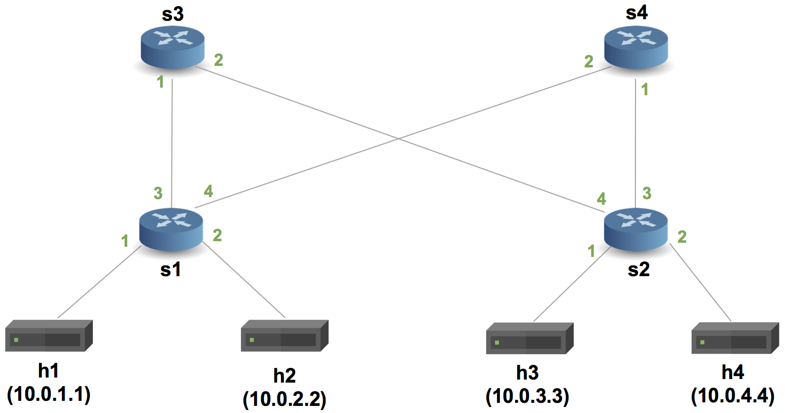

# Отчет по лабораторной работе №4

## Университет
* **University:** [ITMO University](https://itmo.ru/ru/)  
* **Faculty:** [FICT](https://fict.itmo.ru)  
* **Course:** [Network Programming](https://github.com/itmo-ict-faculty/network-programming)  
* **Year:** 2024/2025  
* **Group:** K3321  
* **Author:** Babayev Ruslan Sagibovich  
* **Lab:** Lab4  
* **Date of create:** 16.05.2025  
* **Date of finished:** 21.05.2025  

## Задание

Изучить синтаксис языка программирования P4 и выполнить 2 обучающих задания от Open Network Foundation для ознакомления на практике с P4.

## Ход работы

Перед началом работы была подготовлена среда разработки:
- Склонирован репозиторий [`p4lang/tutorials`](https://github.com/p4lang/tutorials)
- Установлены и настроены Vagrant и VirtualBox
- Виртуальная машина была развернута с помощью `vagrant up` в директории `vm-ubuntu-20.04`
- Все дальнейшие действия производились внутри данной виртуальной машины под пользователем `p4`

### Часть 1: Implementing Basic Forwarding

В первом задании была реализована базовая маршрутизация IPv4-пакетов. Использовалась топология `pod-topo` (fat-tree).



Был написан P4-файл [`basic.p4`](basic.p4), содержащий простую таблицу маршрутизации `ipv4_lpm`. При попадании пакета в свитч выполняется action `ipv4_forward`, в котором TTL уменьшается на единицу и переопределяются MAC-адреса.

После компиляции P4-программы и настройки таблиц маршрутизации была выполнена команда `pingall`. Все узлы успешно обменялись ICMP-сообщениями, что подтверждает корректную реализацию базового форвардинга.


---

### Часть 2: Implementing Basic Tunneling

Во второй части лабораторной работы рассматривалась передача пакетов через виртуальные туннели. В отличие от базовой маршрутизации, здесь использовался дополнительный заголовок `myTunnel_t`, содержащий `proto_id` и `dst_id`.

Использовалась следующая топология из 3 маршрутизаторов и 3 хостов, каждый из которых имел уникальный `dst_id` и IP-адрес:

- h1: 10.0.1.1 (dst_id: 1)  
- h2: 10.0.2.2 (dst_id: 2)  
- h3: 10.0.3.3 (dst_id: 3)  


Была реализована программа [`basic_tunnel.p4`](basic_tunnel.p4), содержащая два типа таблиц:
- `ipv4_lpm` — для обычной маршрутизации
- `myTunnel_exact` — для маршрутизации по `dst_id` в туннелированных пакетах

Пакет отправлялся с помощью скрипта `send.py`, при этом указывался IP-адрес получателя и его `dst_id`.

В первом эксперименте пакет успешно дошел от `h1` до `h2`:

```bash
./send.py 10.0.2.2 "P4 is cool" --dst_id 2
```


Во втором эксперименте была предпринята попытка отправить пакет на `h3`, однако из-за некорректного значения `dst_id` пакет дошел до `h2`. Это произошло потому, что при наличии заголовка `MyTunnel` маршрутизация осуществляется не по IP-адресу, а по полю `dst_id`. Таким образом, свитч полностью игнорирует IP-заголовок и принимает решение на основе пользовательского туннельного заголовка.

```bash
./send.py 10.0.3.3 "P4 is cool" --dst_id 2
```


## Вывод

В ходе выполнения лабораторной работы удалось:

* Ознакомиться с языком P4 и его синтаксисом

* Настроить и использовать среду для тестирования P4-программ с помощью Vagrant и виртуальной машины

* Реализовать два проекта:

  * [basic.p4](basic.p4): простая маршрутизация IPv4

  * [basic_tunnel.p4](basic_tunnel.p4): туннелирование с использованием пользовательского заголовка

* Проверить правильность маршрутизации с помощью pingall и пользовательских скриптов отправки пакетов

Полученные знания и опыт позволяют уверенно ориентироваться в построении P4-программ для анализа и обработки сетевых пакетов.

